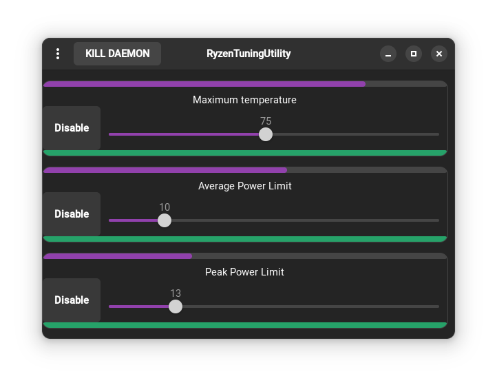

### Ryzen Tuning Utility

  
    

## I am working again on it
I am working on new features such as :
- secure boot support, for now, i have found a module to disable it temporarily, but i am open to a more "safe" solution (maybe adding an exeption).   
- skin temp limit support because, as i have seen, this tends to limit my performance over time (gaming).   
- auto detect , to test the maximum allowed values for your cpu instead of "hardcoding" them, making it more user friendly.
- stapm surveillance, to see if the cpu is throttling for any reason.
- ryzenadj installer, to fix dependency issues if you are using a debian based distro with older packets, and, make it available for the system

All of this by keeping the app accessible to anyone, even if you don't know what you are doing.
The ui will improve a bit too.

## about
A little program that allow you to easily tune your Ryzen's settings.    
You can use it even if you don't really know what you are doing there is not that much of a risk of damaging the cpu because i d'ont allow to modify critical settings

It is not made to overclock the cpu or anything like that, just to change some common setting to get desired performance and noise (fan)

## install
until 3.5 release, clone the latest source for critical fixes.
# requirements
`python` `pip` `gtk4` `libadwaita`    
a ryzen cpu compatible with ryzenadj
working ryzenadj install , to be sure ryzenadj works : `ryzenadj -i`
up-to-date linux distro
`iomem=relaxed` in boot parameters 

run `install.sh` as user
it will ask you for privileges if needed

if an error appears on modules install, install `pyGobject` yoursel and it should work !

## using
just click on the icon in your app menu (first time install it will need to refresh, if it don't appear after 30 secs log out and in)

if you close it by just pressing the arrow , it will still run in background, to show the window click on the icon again

## exit
click on "kill daemon" button then close the window

## current state
Fixed no icon in the launcher  
I d'ont have anyone for testing, if you find any issue, please report it , it would help me so much 
