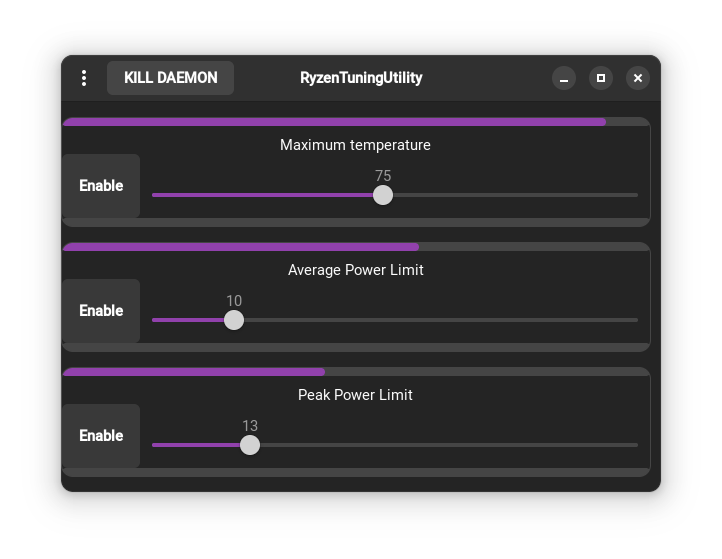

### Ryzen Tuning Utility

  
     

### Warning
I CURRENTLY FOUND A SEVERE PRIVILEDGE ESCALATION TECHNIQUE THAT CAN BE TRIGGERED BY MODIFYING THE START.PY FILE.  
PLUS, THE VERSIONS WITH BATTERY OPTIMISATIONS MAKE MY PC CRASH.   
ONE THIS MESSAGE WILL BE GONE,AT LEAST THE SEC FLAW WILL BE FIXED.

## about
A little program that allow you to easily tune your Ryzen's settings.    
You can use it even if you don't really know what you are doing there is not that much of a risk of damaging the cpu because i d'ont allow to modify critical settings

It is not made to overclock the cpu or anything like that, just to change some common setting to get desired performance and noise (fan)

You can join my discord to get all the latest news https://discord.gg/vHnM2vt5hu 

## install
# requirements
`python` `pip`    
a ryzen cpu compatible with ryzenadj  
a up-to-date linux distro

run `install.sh` as user
it will ask you for privileges if needed

## using
just click on the icon in your app menu (first time install it will need to refresh, if it don't appear after 30 secs log out and in)

if you close it by just pressing the arrow , it will still run in background, to show the window click on the icon again

## exit
click on "kill daemon" button then close the window

## current state
Fixed no icon in the launcher  
I d'ont have anyone for testing, if you find any issue, please report it , it would help me so much 
